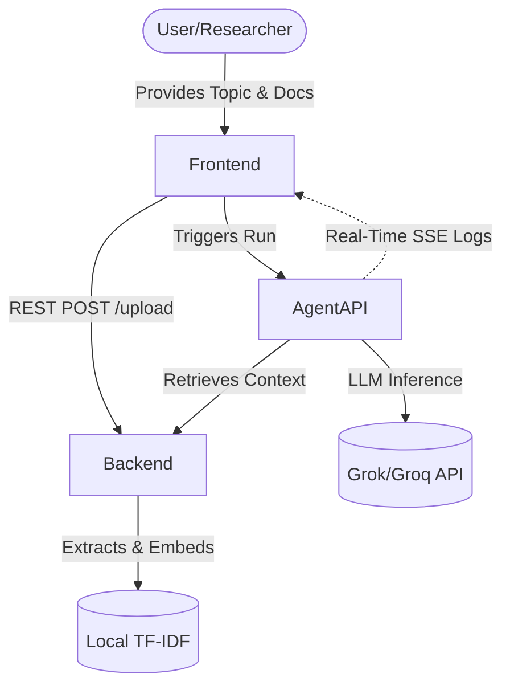

# High-Level Design (HLD)

## 1. System Overview
The Autonomous Research Scientist (ARS) is a scalable, multi-agent AI system designed to fully automate the scientific research process. It transitions the research workflow from manual human literature review to a continuous, autonomous loop of hypothesis generation, experimentation, and analysis.

## 2. Core Architecture
ARS follows a 3-tier microservices architecture:

### 2.1 Presentation Layer (Frontend)
- **Tech Stack:** React.js, Vite, Tailwind CSS, Framer Motion.
- **Role:** Provides a real-time, interactive dashboard for researchers to monitor agent states, input topics, upload documents, and view final research reports.
- **Key Features:** WebSocket/SSE integration for real-time logs, PDF report generation, and interactive data visualization.

### 2.2 Application Layer (Backend & Agents)
- **Backend Service (FastAPI):**
  - Manages document ingestion (PDFs, URLs).
  - Handles text chunking and local TF-IDF vector embeddings for Semantic Search (RAG).
- **Agentic Service (FastAPI + LangGraph):**
  - Orchestrates the 7-step autonomous workflow.
  - Maintains state transitions between agents.
  - Interfaces with the LLM (xAI Grok / Groq Llama 3.3).

### 2.3 Data Layer
- **State Memory:** In-memory workspace tracking the JSON state across the 7 agents.
- **Vector Storage:** Local FAISS/TF-IDF indices for document retrieval.

## 3. Data Flow Diagram

## 4. Scalability & Resilience
- **Stateless Microservices:** Both backend and agent APIs are stateless, allowing horizontal scaling via Docker/Kubernetes.
- **Asynchronous Execution:** Long-running agent tasks are handled asynchronously, preventing blocking of the main thread.
- **Fault Tolerance:** LangGraph ensures state preservation. If an agent fails, the error is logged, and the system attempts to gracefully continue or halt for human intervention.
- **Provider Agnostic:** The system abstracts the LLM provider, allowing seamless switching between OpenAI, Grok, and Groq depending on rate limits and costs.
