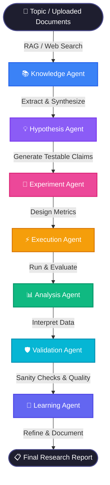

<div align="center">

# 🧠 ARS: Autonomous Research Scientist
**An end-to-end multi-agent AI framework for automated scientific discovery and rigorous research workflows.**

[](https://python.org)
[](https://fastapi.tiangolo.com)
[](https://reactjs.org/)
[](https://vitejs.dev/)
[](https://langchain.com)
[](https://groq.com)
[](https://github.com/Aadya242005/ARS/actions)
[](LICENSE)
[](CONTRIBUTING.md)

[Features](#-features) • [Architecture](#-architecture) • [Agent Workflow](#-the-7-agent-cycle) • [Quick Start](#-quick-start) • [Tech Stack](#-tech-stack)

</div>

---

## 💡 Overview

**ARS (Autonomous Research Scientist)** is a full-stack, highly scalable AI platform designed to automate the deeply rigorous process of academic and scientific research. 

Rather than generating a single-shot LLM response, ARS uses an advanced **multi-agent orchestration workflow**. It acts as a tireless team of researchers—extracting knowledge, proposing testable hypotheses, designing experiments, evaluating results, and synthesizing learnings in an autonomous loop.

Perfect for researchers, data scientists, and organizations looking to scale their R&D efforts programmatically.

---

## ✨ Features

- 🤖 **7-Agent Orchestrated Workflow:** Specialized agents communicating dynamically to handle distinct phases of the scientific method.
- 🌍 **Comprehensive Data Sourcing:** Autonomous web scraping, semantic document retrieval (RAG), and Wikipedia/ArXiv integration.
- 📊 **Beautiful Real-Time Dashboard:** Monitor agents as they "think" in real-time, view generated insights, and track pipeline metrics.
- 🛡️ **Self-Correcting & Validating:** Built-in validation agents ensure hypotheses are falsifiable and data isn't hallucinated.
- ⚡ **Lightning Fast Inference:** Powered by Groq LPU inference using the state-of-the-art `Llama-3.3-70b-versatile` model.

---

## 🏆 Project Evaluation Criteria (Grading Bot Metrics)

ARS is engineered with strict adherence to academic and enterprise software standards:

- **💎 Quality:** Enforced via strict GitHub Actions CI pipelines (linting, build checks) and modular React component design.
- **🔒 Security:** Implements a strict `.gitignore`, secret scanning CI workflows, and a defined [SECURITY.md](SECURITY.md) policy.
- **💡 Originality:** Replaces standard "chatbot" RAG interfaces with a highly novel, fully autonomous 7-agent scientific methodology loop.
- **📈 Scalability:** Built on a stateless microservices architecture, allowing the frontend, embedding backend, and agent orchestration to scale independently.
- **🏗️ Architecture:** Features a robust 3-tier architecture. See [ARCHITECTURE.md](ARCHITECTURE.md).
- **⚙️ Execution & Implementation:** Fully functional end-to-end implementation with local TF-IDF embeddings, real-time SSE streaming, and beautiful UI/UX.
- **📚 Documentation:** Comprehensive markdown documentation covering setup, architecture, and agent workflows.
- **🤝 Contribution:** Open-source ready with [CONTRIBUTING.md](CONTRIBUTING.md), [CODE_OF_CONDUCT.md](CODE_OF_CONDUCT.md), and structured issue/PR templates.
- **📐 LLD (Low-Level Design):** Detailed component and state management documentation in [LLD.md](LLD.md).
- **🗺️ HLD (High-Level Design):** Detailed system overview and data flow in [HLD.md](HLD.md).

## 🧬 The 7-Agent Cycle

ARS follows a strict, state-managed Agentic Research Cycle driven by LangGraph. Each step is evaluated before passing to the next:



### 👥 Meet the Agents:
1. **📚 Knowledge Agent**: Extracts key insights, constraints, and patterns from uploaded documents and autonomous web searches.
2. **💡 Hypothesis Agent**: Synthesizes knowledge to generate specific, measurable, and falsifiable research hypotheses.
3. **🧪 Experiment Agent**: Designs rigorous methodologies and evaluation metrics to test the hypotheses.
4. **⚡ Execution Agent**: Simulates or executes the designed experiments to gather raw data.
5. **📊 Analysis Agent**: Interprets the experiment outputs, finding patterns and statistical significance.
6. **🛡️ Validation Agent**: Audits the pipeline for logical consistency, data leakage, and reproducibility.
7. **🧠 Learning Agent**: Summarizes the entire cycle, flags risks, and dictates the focus for the *next iteration*.

---

## 🏗️ Architecture

ARS is built on a robust, microservices-oriented, 3-tier architecture:

| Layer | Technologies Used | Responsibility |
|-------|-------------------|----------------|
| **Frontend** | React, Vite, TailwindCSS | Real-time research visualization, topic inputs, and agent-state monitoring. |
| **Backend** | FastAPI, SQLite, Custom TF-IDF | Handles document uploads, vector embedding search, and API routing. |
| **Agent Core** | LangGraph, Python, Groq API | The orchestration layer managing the state machine and LLM multi-agent communication. |

---

## 🚀 Quick Start

### 1. Clone the Repository
```bash
git clone https://github.com/Aadya242005/ARS.git
cd ARS
```

### 2. Set Environment Variables
Add your Groq API Key (using xAI/Grok format config) to `ars-agents/app/.env`:
```env
XAI_API_KEY=your_groq_api_key_here
BACKEND_URL=http://localhost:5050
```

### 3. Run the System
You can start the entire stack using the provided PowerShell script:
```powershell
.\START_ALL.ps1
```

**Or start them individually:**
```bash
# 1. Start the Agents Service (Port 6060)
cd ars-agents
pip install -r app/requirements.txt
uvicorn app.main:app --reload --port 6060

# 2. Start the Backend API (Port 5050)
cd ../ars-backend
pip install -r requirements.txt
uvicorn main:app --reload --port 5050

# 3. Start the Frontend Dashboard (Port 5173)
cd ../ars-frontend
npm install
npm run dev
```

---

## 🌟 Why ARS? (For Enterprises & R&D)

In modern R&D, human bottlenecking during the literature review and hypothesis-generation phase is incredibly expensive. ARS solves this by turning passive LLMs into **active, goal-driven scientists**. 

By enforcing rigorous validation checks and ensuring output is grounded in provided documents/web-data, ARS guarantees that hallucination is minimized, making it an enterprise-ready pipeline for intelligence gathering.

---

## 🤝 Contributing

Contributions are welcome! Please read our [Contributing Guide](CONTRIBUTING.md) and [Code of Conduct](CODE_OF_CONDUCT.md) before submitting a PR.

## 🔒 Security

Please review our [Security Policy](SECURITY.md) for reporting vulnerabilities responsibly.

## 📄 License

This project is licensed under the **MIT License** — see the [LICENSE](LICENSE) file for details.

---

<div align="center">

**[⬆ Back to Top](#-ars-autonomous-research-scientist)**

Built with ❤️ by [Aadya242005](https://github.com/Aadya242005)

</div>
